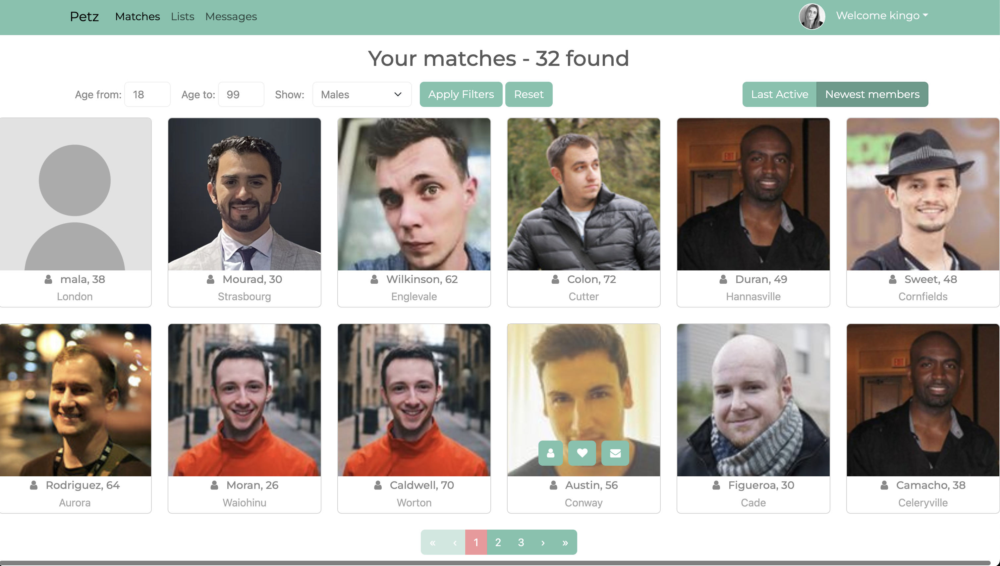

# Petz - Full-Stack Web Development

Petz is a dating app, a web application that I've developed to put my programming skills into practice, focusing on ASP.NET Core, Entity Framework Core, and Angular. While the frontend may not resemble a final product, it served as an excellent opportunity for me to hone my skills in Angular.




## Table of Contents

- [Overview](#overview)
- [Features](#features)
- [Getting Started](#getting-started)
- [Prerequisites](#prerequisites)
- [Installation](#installation)
- [Usage](#usage)
- [License](#license)

## Overview

The Dating Application is a feature-rich web application that covers essential aspects of full-stack development. From setting up the development environment to deploying the application, this project encompasses various modules, each focusing on specific technologies and functionalities.

## Features

- **User Authentication:** Secure user authentication using JWT authentication tokens
- **Photo Upload:** Drag and drop photo upload functionality with an appealing gallery
- **Messaging System:** Private messaging system for seamless communication between users
- **Data Manipulation:** Implement filtering, sorting, and paging of data
- **Real-Time Communication:** Utilize SignalR for real-time presence and live messaging

## Getting Started

Follow these instructions to get a copy of the project up and running on your local machine for development and testing purposes.

### Prerequisites

Ensure you have the following tools installed:

- [Visual Studio Code](https://code.visualstudio.com/)
- [DotNet CLI](https://dotnet.microsoft.com/download)
- [Angular CLI](https://angular.io/cli)

### Installation

1. Clone the repository:

    ```bash
    git clone https://github.com/m-elm/Petz.git
    ```

2. Navigate to the project directory:

    ```bash
    cd Petz
    ```

3. Install dependencies:

    ```bash
    dotnet restore
    cd client
    npm install
    ```

### Usage

1. Open the project in Visual Studio Code:

    ```bash
    code .
    ```

2. Build and run the ASP.NET Core WebAPI:

    ```bash
    dotnet run
    ```

3. Navigate to the Angular app directory and run the development server:

    ```bash
    cd client
    ng serve
    ```

4. Open your browser and go to `http://localhost:4200/` to access the application.


## License

This project is licensed under the MIT License - see the [LICENSE.md](LICENSE.md) file for details.

Happy coding! 🚀
